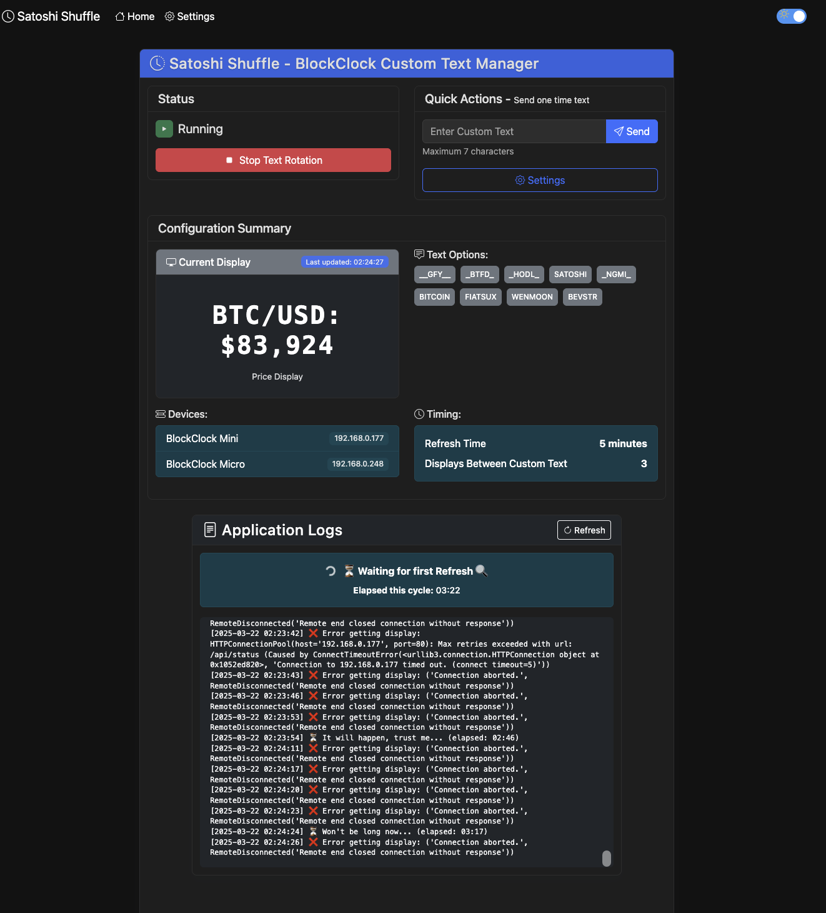

# Satoshi Shuffle

A web application for managing Coinkite BlockClock Mini/Micro devices. Satoshi Shuffle displays custom text messages on your BlockClock that rotate on a configurable schedule.



## Features

- Manage multiple BlockClock devices from a single interface
- Configure custom text messages that appear between regular BlockClock displays
- Easy-to-use web interface with dark mode support
- Real-time monitoring of your BlockClock devices
- Three installation options to suit your preference

## Installation Options

### Option 1: One-Click Installation (Recommended)

The easiest way to get started:

```bash
# Clone the repository
git clone https://github.com/yourusername/satoshi-shuffle.git
cd satoshi-shuffle

# Run the installation script and follow the prompts
python install.py
```

### Option 2: Docker Installation

For users who prefer Docker:

```bash
# Clone the repository
git clone https://github.com/yourusername/satoshi-shuffle.git
cd satoshi-shuffle

# Build and start the Docker container
docker-compose -f docker/docker-compose.yml up -d
```

### Option 3: Manual Python Installation

For advanced users who want more control:

```bash
# Clone the repository
git clone https://github.com/yourusername/satoshi-shuffle.git
cd satoshi-shuffle

# Install dependencies
pip install -r requirements.txt

# Start the application
python webapp/blockclock_web.py
```

## Accessing the Web Interface

Once the application is running, open your web browser and visit:
```
http://localhost:5001
```

## Setting Up Your BlockClock Devices

1. After installation, open the web interface
2. Go to the Settings page
3. Add your BlockClock devices by IP address
4. Configure your custom text messages
5. Start the text rotation service

## Command Line Reference

For common command-line operations, see [CHEATSHEET.md](CHEATSHEET.md)

## Important Notes

- This project is not affiliated with Coinkite
- BlockClock is a product of Coinkite - this is an unofficial companion tool
- Requires Python 3.6 or higher

## License

This project is licensed under the MIT License - see the [LICENSE](LICENSE) file for details.