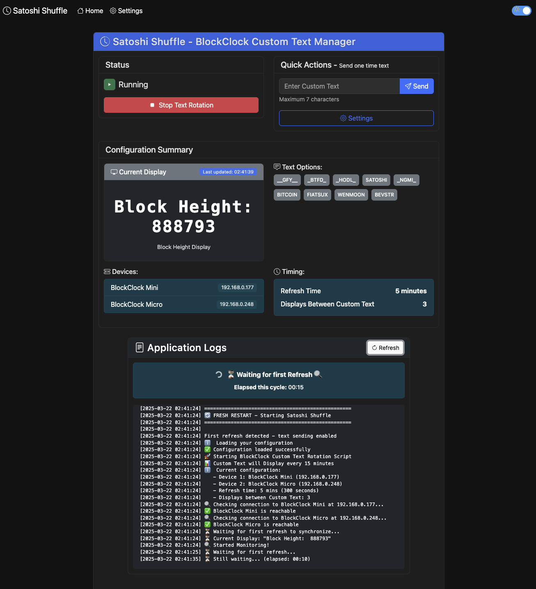

# Satoshi Shuffle

A web application for managing Coinkite BlockClock Mini/Micro devices. Satoshi Shuffle displays custom text messages on your BlockClock that rotate on a configurable schedule.



## Features

- Manage multiple BlockClock devices from a single interface
- Configure custom text messages that appear between regular BlockClock displays
- Easy-to-use web interface with dark mode support
- Real-time monitoring of your BlockClock devices
- Three installation options to suit your preference

## Installation Options

---------------------------------------------------------------------------------

### 📦 OPTION 1: ONE-CLICK INSTALLATION (RECOMMENDED)

Best for: Most users, especially those with limited technical experience.
The easiest way to get started. This method guides you through setup with simple prompts, automatically checks requirements, and configures your system with minimal effort. Perfect if you just want the app working quickly without worrying about technical details.

```bash
# Clone the repository
git clone https://github.com/yourusername/satoshi-shuffle.git
cd satoshi-shuffle

# Run the installation script and follow the prompts
python install.py
```

**Need help?** See the [One-Click Script Installation Guide](docs/installation-script.md) for detailed instructions.

---------------------------------------------------------------------------------

### 🐳 OPTION 2: DOCKER INSTALLATION

Best for: Users familiar with Docker or those who want containerized isolation.
Cleanly isolates the application in a container without affecting your system. Provides consistent behavior across different operating systems and simplifies updates. Ideal if you already use Docker for other applications or want to avoid potential conflicts with existing software.

```bash
# Clone the repository
git clone https://github.com/yourusername/satoshi-shuffle.git
cd satoshi-shuffle

# Build and start the Docker container
docker-compose -f docker/docker-compose.yml up -d
```

**Need help?** See the [Docker Installation Guide](docs/installation-docker.md) for detailed instructions.

---------------------------------------------------------------------------------

### 🐍 OPTION 3: MANUAL PYTHON INSTALLATION

Best for: Advanced users who want complete control over the installation.
Gives you direct access to all components for customization. You'll install dependencies yourself and have full visibility into the process. Choose this if you're comfortable with Python development, want to customize the code, or need to integrate with existing systems.

```bash
# Clone the repository
git clone https://github.com/yourusername/satoshi-shuffle.git
cd satoshi-shuffle

# Install dependencies
pip install -r requirements.txt

# Start the application
python webapp/blockclock_web.py
```

**Need help?** See the [Python Installation Guide](docs/installation-python.md) for detailed instructions.

---

## Accessing the Web Interface

Once the application is running, open your web browser and visit:
```
http://localhost:5001
```

## Setting Up Your BlockClock Devices

1. After installation, open the web interface
2. Go to the Settings page
3. Add your BlockClock devices by IP address
4. Configure your custom text messages
5. Start the text rotation service

## Additional Documentation

- [Configuration Guide](docs/configuration.md) - How to configure Satoshi Shuffle after installation
- [Troubleshooting Guide](docs/troubleshooting.md) - Solutions for common issues
- [Command Line Cheatsheet](CHEATSHEET.md) - Quick reference for terminal commands

## Important Notes

- This project is not affiliated with Coinkite
- BlockClock is a product of Coinkite - this is an unofficial companion tool
- Requires Python 3.6 or higher

## License

This project is licensed under the MIT License - see the [LICENSE](LICENSE) file for details.